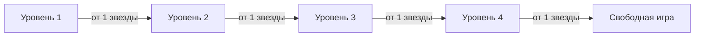

# Игровая прогрессия

## Две ролевые ветки

Пользователь проходит обучение отдельно как покупатель и как продавец. Звёзды и открытые уровни одной роли не переносятся в другую: безопасное поведение покупателя и продавца проверяется разными ситуациями.

Каждая ролевая ветка содержит четыре последовательных уровня. После завершения четвёртого открывается «Свободная игра» — отдельный режим, а не пятый уровень.

## Уровни

| Уровень | Ответ пользователя | Собеседник | Назначение |
| --- | --- | --- | --- |
| 1 | Готовые, заметно различающиеся варианты | Полностью шаблонный сценарий | Познакомить с базовыми опасными признаками и безопасными действиями |
| 2 | Готовые, похожие по смыслу варианты | Полностью шаблонный сценарий | Научить выбирать безопасное действие без очевидной подсказки |
| 3 | Готовый вариант или собственный текст | Сценарий управляет ходом разговора, модель оценивает и обрабатывает свободный ответ | Перейти от узнавания правильного варианта к самостоятельной формулировке |
| 4 | Только собственный текст | Модель ведёт разговор и всегда играет мошенника | Проверить навык в свободном диалоге без готовых ответов |

Первые два уровня должны полностью настраиваться через данные: реплики, варианты, баллы и объяснения не зашиваются в Go-код.

На третьем уровне готовый вариант и свободный текст являются двумя способами ответить на один шаг. Пользователь отправляет что-то одно; это сохраняется одной записью ответа.

## Свободная игра

Свободная игра открывается отдельно для каждой роли после прохождения её четвёртого уровня.

При старте система выбирает тип собеседника: мошенник или обычный участник сделки. Выбор скрыт от пользователя и сохраняется на всё прохождение, чтобы поведение собеседника не менялось посреди разговора.

Режим не участвует в открытии уровней. Его задача — проверить, умеет ли пользователь отличать реальную угрозу от обычной сделки, а не просто отказываться от любого предложения.

## Баллы, звёзды и доступ

- Каждое завершённое прохождение получает числовой результат.
- Количество звёзд определяется по результату: от одной до трёх для пройденного уровня, ноль — для непройденного.
- Следующий уровень открывается после одной звезды на предыдущем.
- В интерфейсе показывается лучший результат уровня.
- Повторная попытка не уменьшает уже полученные звёзды.
- Три звезды нужны для дополнительной мотивации и достижений, но не блокируют основной путь.
- Признак `is_locked` вычисляется из прогресса и возвращается клиенту; отдельным источником истины в БД он не хранится.

Точные пороги звёзд и правила критических ошибок пока не утверждены.

## Роль генеративной модели

| Режим | Что делает модель |
| --- | --- |
| Уровни 1–2 | Не участвует в ходе разговора |
| Уровень 3 | Понимает свободный ответ пользователя, оценивает его по заданным правилам и формирует реакцию |
| Уровень 4 | Генерирует реплики мошенника в рамках заданного контекста и цели сценария |
| Свободная игра | Ведёт свободный разговор в роли выбранного при старте типа собеседника |

Модель не должна сама придумывать правила начисления баллов. Сценарий задаёт критерии оценки, а модель возвращает структурированный результат, который проверяет сервисный слой.

## Настройка контента

Для сценария необходимо хранить:

- роль пользователя;
- уровень и режим ответа;
- контекст сделки и мошенническую схему;
- последовательность шагов;
- шаблонные реплики и цель каждого шага;
- варианты ответа, баллы и объяснения;
- инструкции и запасную реплику для модели там, где она используется.

В первой версии сценарий может оставаться линейным. Полноценное дерево переходов следует добавлять только после появления сценария, которому действительно не хватает общей последовательности шагов.
