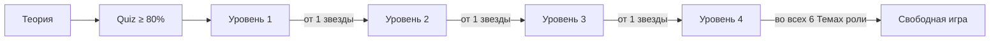

# Игровая прогрессия

## Две ролевые ветки

Пользователь проходит обучение отдельно как покупатель и как продавец. Звёзды и открытые уровни одной роли не переносятся в другую: безопасное поведение покупателя и продавца проверяется разными ситуациями.

Каждая ролевая ветка содержит шесть Тем. В каждой Теме Пользователь читает Теорию, проходит Quiz минимум на 80% и затем открывает четыре последовательных Уровня. Свободная игра остаётся отдельным режимом, а не пятым Уровнем.

## Уровни

| Уровень | Ответ пользователя | Собеседник | Назначение |
| --- | --- | --- | --- |
| 1 | Готовые, заметно различающиеся варианты | Полностью шаблонный сценарий | Познакомить с базовыми опасными признаками и безопасными действиями |
| 2 | Готовые, похожие по смыслу варианты | Полностью шаблонный сценарий | Научить выбирать безопасное действие без очевидной подсказки |
| 3 | Готовый вариант или собственный текст | Сценарий управляет ходом разговора, модель оценивает и обрабатывает свободный ответ | Перейти от узнавания правильного варианта к самостоятельной формулировке |
| 4 | Только собственный текст | Модель ведёт разговор и всегда играет мошенника | Проверить навык в свободном диалоге без готовых ответов |

Первые два уровня должны полностью настраиваться через данные: реплики, варианты, баллы и объяснения не зашиваются в Go-код.

На третьем уровне готовый вариант и свободный текст являются двумя способами ответить на один шаг. Пользователь отправляет что-то одно; это сохраняется одной записью ответа.

## Свободная игра

Свободная игра открывается отдельно для каждой роли после прохождения Уровня 4 хотя бы на одну Звезду во всех шести Темах этой роли.

GameState содержит Тему, `product_context`, текущий Шаг сценария, допустимый способ ответа, варианты и упорядоченную историю. Клиент отправляет актуальный `step_id`; устаревший Шаг получает `STALE_STEP`. `step_goal` остаётся внутренней инструкцией, интерфейс получает только `counterparty_message`.

При старте система выбирает тип собеседника: мошенник или обычный участник сделки. Выбор скрыт от пользователя и сохраняется на всё прохождение, чтобы поведение собеседника не менялось посреди разговора.

Режим не участвует в открытии уровней. Его задача — проверить, умеет ли пользователь отличать реальную угрозу от обычной сделки, а не просто отказываться от любого предложения.

## Баллы, звёзды и доступ

- Каждый вариант ответа получает оценку качества безопасного действия: 0, 25, 50, 75 или 100 сырых очков. Вариант не обязан быть полностью безопасным или полностью опасным.
- Итоговый Балл Прохождения — процент от максимума сырых очков всех его Шагов сценария, округлённый до ближайшего целого значения от 0 до 100; при значении ровно посередине применяется округление вверх.
- Количество звёзд определяется по результату: от одной до трёх для пройденного уровня, ноль — для непройденного.
- Следующий уровень открывается после одной звезды на предыдущем.
- В интерфейсе показывается лучший результат уровня.
- Повторная попытка не уменьшает уже полученные звёзды.
- Три звезды нужны для дополнительной мотивации и достижений, но не блокируют основной путь.
- Признак `is_locked` вычисляется из прогресса и возвращается клиенту; отдельным источником истины в БД он не хранится.
- Сервер отклоняет запуск закрытого уровня с `403 Forbidden`; клиентское отображение открытости не заменяет эту проверку.

Пользователь получает объяснения к отдельным Ответам пользователя и итоговый разбор только после завершения Прохождения. Во время управляемого Сценария система не раскрывает правильность промежуточного выбора, чтобы не подсказывать решение следующего Шага сценария.

Последний Ответ пользователя автоматически завершает Прохождение. В одной атомарной операции система сохраняет этот ответ, рассчитывает итоговый Балл и Звёзды, обновляет Прогресс и возвращает итоговый разбор. Отдельной команды завершения нет.

Для Уровня 4 и Свободной игры `finish=true` допустим в третьем и последующих свободных Ответах пользователя. Клиент получает `can_finish_early=true` после двух сохранённых ответов. Пятый свободный Ответ пользователя завершает Прохождение независимо от `finish`. При ошибке AI ответ, Сообщения, счётчик, Балл и Прогресс не записываются, поэтому команду можно безопасно повторить.

Пользователь может явно бросить только собственное незавершённое Прохождение. Оно переходит в статус `ABANDONED`, не получает Балл и не изменяет Прогресс.

Для одной пары «Пользователь — Сценарий» может существовать только одно незавершённое Прохождение. Повторный запуск Сценария возвращает это Прохождение с текущим Шагом сценария и историей; новая попытка создаётся только после завершения или отказа от предыдущей.

Звёзды определяются итоговым Баллом: одна — от 55, две — от 70, три — от 85. Правила критических ошибок и отрицательные баллы в первой фиче не вводятся.

## Роль генеративной модели

| Режим | Что делает модель |
| --- | --- |
| Уровни 1–2 | Не участвует в ходе разговора |
| Уровень 3 | Понимает свободный ответ пользователя, оценивает его по заданным правилам и формирует реакцию |
| Уровень 4 | Генерирует реплики мошенника в рамках заданного контекста и цели сценария |
| Свободная игра | Ведёт свободный разговор в роли выбранного при старте типа собеседника |

Модель не должна сама придумывать правила начисления баллов. Сценарий задаёт критерии оценки, а модель возвращает структурированный результат, который проверяет сервисный слой.

Результат содержит только `awarded_points` из набора 0/25/50/75/100, непустые `explanation` и `reply`, а также массив `risk_signals`. Неизвестные поля, лишний JSON и неполные значения отклоняются до записи состояния.

## Настройка контента

Для сценария необходимо хранить:

- роль пользователя;
- уровень и режим ответа;
- контекст сделки и мошенническую схему;
- последовательность шагов;
- шаблонные реплики и цель каждого шага;
- варианты ответа, баллы и объяснения;
- инструкции и запасную реплику для модели там, где она используется.

В первой версии сценарий может оставаться линейным. Полноценное дерево переходов следует добавлять только после появления сценария, которому действительно не хватает общей последовательности шагов.

Администратор создаёт и редактирует неактивный Сценарий, включая его Шаги сценария и варианты ответа. Активный Сценарий нельзя изменять: его необходимо сначала деактивировать, затем изменить и вновь активировать. Благодаря этому незавершённое Прохождение всегда использует один и тот же учебный контент без версионирования сценариев в MVP. Удаление администратором архивирует Сценарий: он исчезает из каталога и недоступен для новых Прохождений, но история и Прогресс сохраняются. Архивный Сценарий можно восстановить только неактивным; чтобы он снова стал доступен пользователям, администратор публикует его отдельной операцией.

Тема использует тот же lifecycle `draft → published → draft` и `draft|published → archived`. Блоки Теории, вопросы Quiz и варианты Quiz изменяются только в `draft`. Публикация — одна атомарная операция, проверяющая пять блоков Теории, пять вопросов по четыре варианта с ровно одним правильным и опубликованные Сценарии Уровней 1–4 той же ролевой ветки.

## Задание дня

Dashboard сохраняет одну рекомендацию на московскую дату и ролевую ветку. Незавершённое Прохождение имеет приоритет, затем идут непрочитанная Теория, непройденный Quiz, следующий открытый Уровень и Свободная игра после основной последовательности. Выполненное задание остаётся видимым до полуночи. Незавершённая цель, ставшая недоступной после администрирования, заменяется; выполненная не переписывается.
