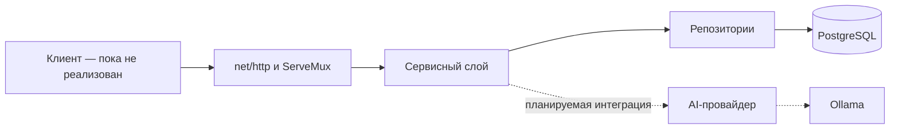

# Архитектура

## Общая схема

Проект развивается как монолитное приложение. Код сгруппирован по продуктовым модулям: HTTP-обработчики вызывают сервисы, сервисы обращаются к репозиториям, а репозитории работают с PostgreSQL через `go-pg`.

Ollama уже можно поднять через Docker Compose, но стрелка от сервисов к AI-провайдеру пока обозначает принятое направление, а не существующий вызов.

## Компоненты

### Точка входа

`backend/main.go` создаёт приложение через `app_builder.NewApp`, запускает HTTP-сервер и закрывает соединение с БД при остановке.

### Сборка приложения

`backend/app_builder` является узким composition root и отвечает за:

- чтение переменных окружения;
- создание подключения к PostgreSQL;
- связывание PostgreSQL-реализаций репозиториев с сервисами и HTTP-обработчиками;
- сборку роутера.

HTTP-обработчики и SQL-запросы в нём не размещаются. Жизненный цикл HTTP-сервера остаётся в `main.go`.

### HTTP-слой

Маршруты собраны на `http.ServeMux`. В каждом продуктовом модуле есть пакет `http` с обработчиком и собственными request/response DTO. DTO преобразуются в доменные типы до вызова сервиса.

### Сервисы

Сервис каждого модуля зависит от малого интерфейса своего репозитория. Чистые предметные правила, не требующие внешних систем, находятся в `internal/core/domain`; например, допустимые переходы статуса прохождения и расчёт звёзд по баллу.

### Репозитории

PostgreSQL-репозитории находятся рядом с сервисом и HTTP-слоем соответствующего модуля. Они используют `go-pg` и закрытые модели хранения, преобразуя их в доменные типы.

### Хранилище

Основное хранилище — PostgreSQL. Текущая и целевая предметная модель описаны отдельно в [модели данных](data-model.md).

## Технологии

| Зона | Технология | Фактическое использование |
| --- | --- | --- |
| Бэкенд | Go 1.26.5 | Версия объявлена в `backend/go.mod` |
| HTTP | `net/http` | Сервер и маршрутизация |
| Доступ к данным | `github.com/go-pg/pg` v8 | CRUD-репозитории |
| База данных | PostgreSQL 18.1 | Контейнер в основном Compose-файле |
| Миграции | `migrate/migrate` 4.19.1 | Одноразовый контейнер применяет versioned-миграции перед запуском API в Compose |
| Локальная модель | Ollama 0.32.6 | Контейнер и загрузка модели; вызова из бэкенда пока нет |
| Оркестрация | Docker Compose, Make | Локальная инфраструктура и команды разработчика |
| Прокси | Nginx | Конфигурация пока пустая |
| Фронтенд | Не выбран в коде | В репозитории есть только пустая заготовка окружения |

## Архитектурные решения

- [ADR-0001: монолит и трёхслойный бэкенд](adr/0001-monolith-and-three-layers.md)
- [ADR-0002: локальная генеративная модель через Ollama](adr/0002-local-ai-through-ollama.md)
- [ADR-0003: четыре уровня и отдельная свободная игра](adr/0003-four-levels-and-free-play.md)
- [ADR-0004: продуктовые модули внутри трёхслойного бэкенда](adr/0004-feature-oriented-three-layer-backend.md)

Не каждое обсуждение становится ADR. Запись нужна, если решение заметно ограничивает устройство системы и важно понимать, почему выбран именно этот вариант.
