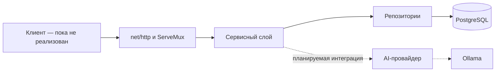

# Архитектура

## Общая схема

Проект развивается как монолитное приложение. В текущем коде HTTP-обработчики вызывают сервисы, сервисы обращаются к репозиториям, а репозитории работают с PostgreSQL через `go-pg`.

Ollama уже можно поднять через Docker Compose, но стрелка от сервисов к AI-провайдеру пока обозначает принятое направление, а не существующий вызов.

## Компоненты

### Точка входа

`backend/main.go` создаёт приложение через `app_builder.NewApp`, запускает HTTP-сервер и закрывает соединение с БД при остановке.

### Сборка приложения

`backend/app_builder` сейчас отвечает сразу за:

- чтение переменных окружения;
- создание подключения к PostgreSQL;
- регистрацию маршрутов;
- запуск HTTP-сервера.

Это composition root приложения: инфраструктурные зависимости создаются в одном месте и передаются дальше явно.

### HTTP-слой

Маршруты собраны на `http.ServeMux`. Отдельного пакета transport/handlers пока нет; обработчики находятся в `app_builder`.

### Сервисы

Пакет `services` должен быть местом бизнес-правил и координации операций. Сейчас его методы в основном делегируют запросы репозиториям, потому что бизнес-цикл тренажёра ещё не реализован.

### Репозитории

Пакет `repositories` изолирует SQL-хранилище от остального приложения. Репозитории используют `go-pg` и структуры из `models`.

### Хранилище

Основное хранилище — PostgreSQL. Текущая и целевая предметная модель описаны отдельно в [модели данных](data-model.md).

## Технологии

| Зона | Технология | Фактическое использование |
| --- | --- | --- |
| Бэкенд | Go 1.26.5 | Версия объявлена в `backend/go.mod` |
| HTTP | `net/http` | Сервер и маршрутизация |
| Доступ к данным | `github.com/go-pg/pg` v8 | CRUD-репозитории |
| База данных | PostgreSQL 18.1 | Контейнер в основном Compose-файле |
| Миграции | `migrate/migrate` 4.19.1 | Контейнер подготовлен, формат текущего SQL-файла ещё не совместим с командой `migrate-up` |
| Локальная модель | Ollama 0.32.6 | Контейнер и загрузка модели; вызова из бэкенда пока нет |
| Оркестрация | Docker Compose, Make | Локальная инфраструктура и команды разработчика |
| Прокси | Nginx | Конфигурация пока пустая |
| Фронтенд | Не выбран в коде | В репозитории есть только пустая заготовка окружения |

## Архитектурные решения

- [ADR-0001: монолит и трёхслойный бэкенд](adr/0001-monolith-and-three-layers.md)
- [ADR-0002: локальная генеративная модель через Ollama](adr/0002-local-ai-through-ollama.md)
- [ADR-0003: четыре уровня и отдельная свободная игра](adr/0003-four-levels-and-free-play.md)

Не каждое обсуждение становится ADR. Запись нужна, если решение заметно ограничивает устройство системы и важно понимать, почему выбран именно этот вариант.
