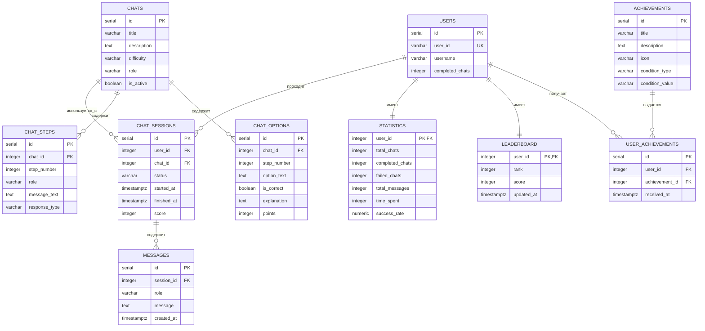
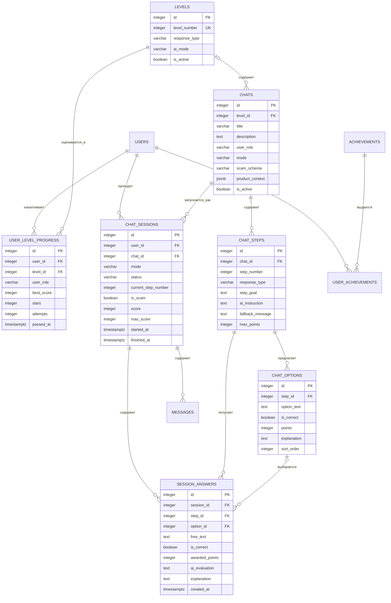

# Модель данных

## Базовая схема

Начальная versioned-миграция `backend/migrations/000001_initial_schema.up.sql` создаёт десять таблиц. Парный файл `.down.sql` удаляет их в обратном порядке.

Go-модели и CRUD сейчас существуют только для `users`, `scenarios` и `attempts`; PostgreSQL-адаптеры сохраняют исторические имена таблиц `chats` и `chat_sessions` как техническую деталь.

## Принятая целевая модель

Миграция `000002_training_model` переводит базовую схему к этой модели: добавляет уровни, отдельный прогресс по ролям, ответы внутри прохождения и корректное владение вариантами ответа. Совместимые с текущим CRUD поля `chats.role` и `chats.difficulty` временно сохранены; `user_role` дублирует `role`, когда он заполнен новой логикой.

На схеме опущены уже принятые поля `users`, `messages`, `achievements` и `user_achievements`, которые не меняют механику уровней. Для `users` целевая модель аутентификации определена ниже.

### Идентификация пользователя

Миграция `000003_local_accounts` заменила временный внешний идентификатор `users.user_id` локальной учётной записью:

- `id` остаётся внутренним ключом PostgreSQL для связей с прохождениями и прогрессом;
- `username` — обязательный уникальный логин пользователя;
- `password_hash` хранит только bcrypt-хеш пароля;
- `access_role` принимает `user` или `admin` и определяет доступ к тренажёру или будущей админке;
- `user_id` удаляется и не возвращается публичным API.

Учётные данные не должны смешиваться с ролевой веткой: покупатель и продавец — роли пользователя в тренировке, а не отдельные учётные записи.

Для MVP логин и пароль должны быть непустыми. Других ограничений длины или состава нет; уникальность логина обеспечивает база данных без учёта регистра. Перед сохранением и проверкой входа логин нормализуется к нижнему регистру.

Публичная регистрация создаёт только `user`. Единственная учётная запись с ролью `admin` создаётся при запуске из конфигурации; частичный уникальный индекс не допускает второй `admin`, а API не назначает и не изменяет роли доступа.

### Режимы уровней

| Уровень | `response_type` | `ai_mode` |
| --- | --- | --- |
| 1 | `multiple_choice` | `disabled` |
| 2 | `similar_choice` | `disabled` |
| 3 | `mixed` | `evaluate_and_reply` |
| 4 | `free_text` | `generate` |

Свободная игра не является записью пятого уровня. Она запускается как отдельный режим сессии. Поле `is_scam` для такой сессии выбирается при старте и после этого не изменяется.

### Режимы прохождения

- `scenario` — прохождение сценария; `chat_id` обязателен.
- `free_play` — свободная игра; `chat_id` отсутствует, потому что она не привязана к готовому шаблону.

Статус прохождения принимает одно из значений `IN_PROGRESS`, `COMPLETED` или `ABANDONED`. Только незавершённое прохождение может перейти в один из финальных статусов; правило перехода реализовано как чистое правило домена и вызывается сервисом прохождений. Для свободной игры `is_scam` обязателен и после старта не изменяется; для сценарного прохождения он отсутствует.

### Правила целевой модели

- `chat_options` принадлежит конкретному `chat_step` через `step_id`.
- `session_answers` хранит результат шага: либо `option_id`, либо `free_text`.
- Пара `(session_id, step_id)` в `session_answers` уникальна.
- Пара `(chat_id, step_number)` в `chat_steps` уникальна.
- Пара `(step_id, sort_order)` в `chat_options` уникальна.
- Прогресс уникален по тройке `(user_id, user_role, level_id)`.
- Лучшие звёзды не уменьшаются после неудачного повторного прохождения.
- `is_locked` не хранится: доступ вычисляется по прогрессу предыдущего уровня в той же ролевой ветке.
- Физические таблицы статистики и рейтинга не нужны для MVP; значения можно вычислять из прохождений и прогресса.
- Роль пользователя ограничена `buyer` и `seller`; тип ответа — `multiple_choice`, `similar_choice`, `mixed` или `free_text`; режим AI — `disabled`, `evaluate_and_reply` или `generate`.
- Звёзды назначаются от итогового балла: одна — от 55, две — от 70, три — от 85.

## Инварианты, уже выраженные в SQL

- `users.username` уникален после нормализации к нижнему регистру, а `access_role='admin'` возможен только у одной учётной записи;
- номер шага уникален внутри сценария;
- пользователь не может дважды получить одно достижение;
- прохождение сценария ссылается на существующих пользователя и сценарий, а свободная игра — только на пользователя;
- сообщения удаляются вместе с сессией.

Индекс `chat_options(chat_id, step_number)` не уникален: один шаг сценария может иметь несколько вариантов ответа. В целевой модели варианты будут связаны с `chat_steps` через `step_id`.

История изменения лучшего прогресса пока не хранится отдельно: для MVP достаточно текущего лучшего результата и сохранённых прохождений.
