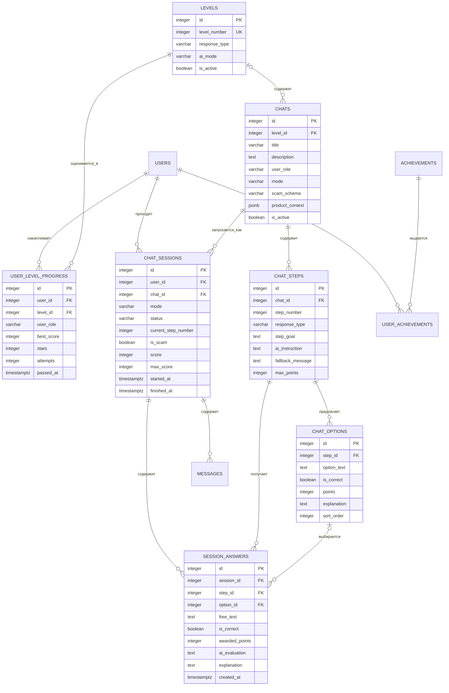

# Модель данных

## Реализованная схема

Текущий `backend/migrations/init.sql` создаёт десять таблиц.

Go-модели и CRUD сейчас существуют только для `users`, `chats` и `chat_sessions`.

## Принятая целевая модель

Текущий SQL появился до согласования игрового цикла и будет заменён новой миграцией. Целевая модель включает уровни, отдельный прогресс по ролям, ответы внутри прохождения и корректное владение вариантами ответа.

На схеме опущены уже принятые поля `users`, `messages`, `achievements` и `user_achievements`, которые не меняют механику уровней.

### Режимы уровней

| Уровень | `response_type` | `ai_mode` |
| --- | --- | --- |
| 1 | `multiple_choice` | `disabled` |
| 2 | `similar_choice` | `disabled` |
| 3 | `mixed` | `evaluate_and_reply` |
| 4 | `free_text` | `generate` |

Свободная игра не является записью пятого уровня. Она запускается как отдельный режим сессии. Поле `is_scam` для такой сессии выбирается при старте и после этого не изменяется.

### Правила целевой модели

- `chat_options` принадлежит конкретному `chat_step` через `step_id`.
- `session_answers` хранит результат шага: либо `option_id`, либо `free_text`.
- Пара `(session_id, step_id)` в `session_answers` уникальна.
- Пара `(chat_id, step_number)` в `chat_steps` уникальна.
- Пара `(step_id, sort_order)` в `chat_options` уникальна.
- Прогресс уникален по тройке `(user_id, user_role, level_id)`.
- Лучшие звёзды не уменьшаются после неудачного повторного прохождения.
- `is_locked` не хранится: доступ вычисляется по прогрессу предыдущего уровня в той же ролевой ветке.
- Физические таблицы статистики и рейтинга не нужны для MVP; значения можно вычислять из прохождений и прогресса.

## Инварианты, уже выраженные в SQL

- внешний `users.user_id` уникален;
- номер шага уникален внутри сценария;
- пользователь не может дважды получить одно достижение;
- сессия ссылается на существующих пользователя и сценарий;
- сообщения удаляются вместе с сессией.

Индекс `chat_options(chat_id, step_number)` сейчас также уникален. Для нескольких вариантов на одном шаге это ограничение ошибочно, поэтому на него нельзя опираться как на предметное правило.

## Что ещё требует решения перед миграцией

- точные SQL-типы и ограничения для перечислений;
- может ли `chat_id` отсутствовать у полностью генерируемой свободной игры или для неё всегда создаётся сценарий-конфигурация;
- перечень статусов прохождения;
- пороги звёзд и правила критических ошибок;
- нужна ли история изменения лучшего прогресса помимо сохранённых сессий.
